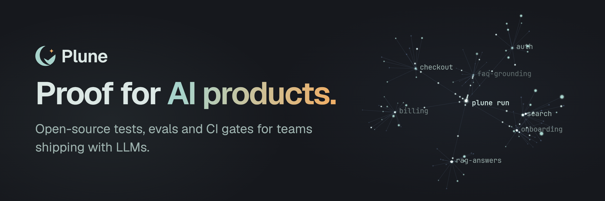

  

**Proof for AI products.** Open-source tools and a platform for teams shipping with LLMs.
Nothing enters your test suite silently.

- 🧭 **[Cairn](https://github.com/plune-ai/cairn)** — an AI agent that explores your app and writes Playwright tests, UI and API.
- ✅ **[Plune CLI](https://github.com/plune-ai/cli)** — evals for LLM output in one `plune.yaml`, locally or in CI; it also imports JUnit and Playwright results into the platform.
- 🚦 **[eval-action](https://github.com/plune-ai/eval-action)** — runs your evals on every pull request and comments the regression diff.
- 🗂 **Platform** — cases, runs and the review queue in one place. In beta.

[plune.ai](https://plune.ai) · [Docs](https://docs.plune.ai) · [hello@plune.ai](mailto:hello@plune.ai) · Building from Ukraine 🇺🇦
